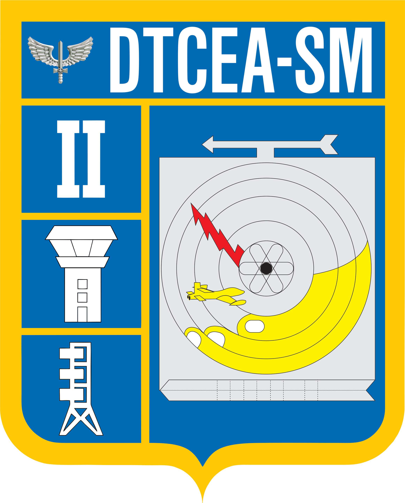

<div align="center">



# Almox Proensa

### Sistema de Almoxarifado e Controle de Estoque

Sistema web para o setor de **Suprimento do DTCEA-SM** (Destacamento de Controle do Espaço
Aéreo de Santa Maria), criado para substituir as planilhas no controle de materiais —
entradas, saídas, ajustes, alertas de reposição e relatórios.


</div>

---

## ✨ Visão geral

O **Almox Proensa** nasceu de uma dor real: o controle de materiais feito por planilhas
confusas e sujeitas a erro. A proposta é um sistema **rápido, claro e didático**, pensado para
operadores de estoque — não um dashboard decorativo, e sim uma ferramenta de trabalho diário.

> 🎯 Foco em **usabilidade operacional**: poucos cliques, leitura fácil, ações em destaque e
> baixa curva de aprendizado.

## 🧩 Funcionalidades

- **Dashboard operacional** — KPIs (estoque, entradas, saídas, itens críticos), ações rápidas,
  estoque baixo, últimas movimentações e gráficos úteis (entradas × saídas, consumo por setor,
  materiais mais retirados, distribuição por categoria).
- **Materiais** — lista em ordem alfabética, busca, filtros por status, cadastro, edição e
  exclusão; exportação em CSV.
- **Entrada / Saída** — telas dedicadas. A entrada registra o responsável do Suprimento e o
  documento (GFM/GMM); a saída registra o militar que retirou e o setor de destino, com
  **alerta de saldo insuficiente**.
- **Ajuste de estoque** — correção de saldo (inventário/perda) direto na edição do material,
  registrando no histórico.
- **Alertas** — central de itens **zerados, críticos e em atenção** (somem sozinhos quando o
  estoque volta acima do mínimo).
- **Movimentações** — histórico completo com filtros (tipo, material, militar, período) e
  saldo anterior/final por lançamento.
- **Relatórios** — filtros avançados (período, material, categoria, setor, militar) com
  exportação em **CSV** e **PDF** (documento oficial com brasão, pronto para apresentar).
- **Cadastros** — gestão de categorias, unidades de medida e locais/corredores (integrados
  a todo o sistema).
- **Guia do sistema** — central de ajuda com índice, passo a passo, conceitos e FAQ.
- **Tema claro/escuro** e perfil editável.

## 🛠️ Stack

- **React 18** + **TypeScript** + **Vite**
- CSS com **design tokens** (tema claro/escuro, tipografia Source Sans 3)
- Ícones **Lucide**
- Gráficos e relatórios em **SVG/HTML puro** (sem libs pesadas)

## 🚀 Como rodar

Pré-requisito: **Node.js 18+**.

```bash
npm install     # instala as dependências
npm run dev     # ambiente de desenvolvimento → http://localhost:5173
npm run build   # build de produção (pasta /dist)
npm run preview # pré-visualiza o build
```

## 📁 Estrutura

```
src/
├─ components/        # telas e componentes (Dashboard, Materiais, Entradas, Relatórios…)
├─ colors_and_type.css# design tokens (cores, tipografia, sombras)
├─ index.css         # estilos base, animações e CSS de impressão (PDF)
├─ App.tsx           # componente raiz
└─ main.tsx          # ponto de entrada
public/assets/       # brasão DTCEA-SM
```

## 📸 Preview


<div align="center">

Desenvolvido por **Matheus Proensa** — Cb Proensa · ex-militar do **DTCEA-SM**.

</div>
